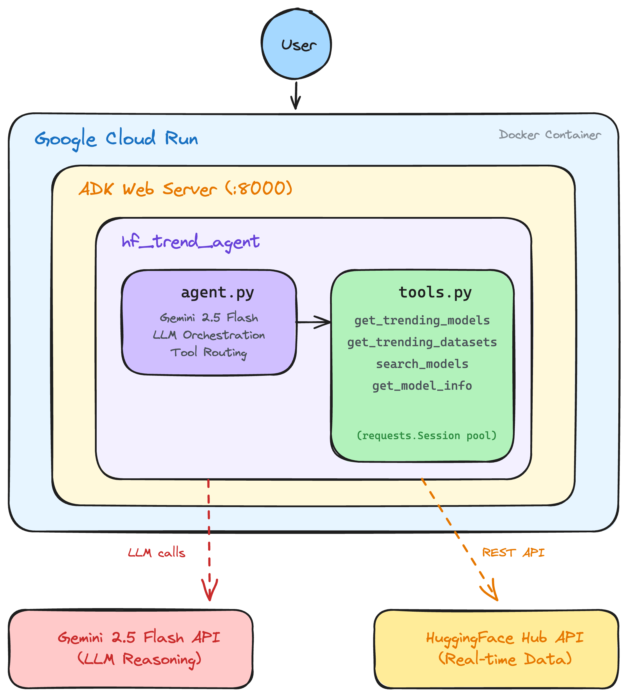

# HF Trend Agent — Hugging Face Hub Trend Analyzer

> Gen AI Academy APAC Edition — Cohort 1, Track 1: Build and Deploy AI Agents

An AI-powered conversational agent that analyzes trending models and datasets on the **Hugging Face Hub** in real-time, built with **Google ADK** and **Gemini 2.5 Flash**, deployed on **Google Cloud Run**.

## Architecture

## Overview

This agent connects to the Hugging Face Hub public REST API and provides:

- **Trending Models** — discover what's hot right now, filterable by 14 task types
- **Trending Datasets** — find popular datasets gaining traction
- **Model Search** — search models by keyword (e.g. "exaone", "whisper", "korean")
- **Model Details** — get detailed info about any specific model

## Tools

| Tool | Description | Example |
|------|-------------|---------|
| `get_trending_models` | Fetch trending models, optionally filtered by task | `"Show me trending text-generation models"` |
| `get_trending_datasets` | Fetch trending datasets | `"What datasets are trending?"` |
| `search_models` | Search models by keyword with sorting options | `"Search for EXAONE models sorted by downloads"` |
| `get_model_info` | Get detailed info for a specific model | `"Tell me about openai/whisper-large-v3"` |

## Tech Stack

| Layer | Technology |
|-------|-----------|
| Framework | Google Agent Development Kit (ADK) |
| LLM | Gemini 2.5 Flash |
| Language | Python 3.13 |
| Data Source | Hugging Face Hub REST API |
| Deployment | Google Cloud Run (Docker) |

## Example Conversations

**User**: `"Show me the hottest trending models right now"`
> Fetches top trending models with download counts, likes, trending scores, and direct HuggingFace links.

**User**: `"Search for Korean STT models"`
> Searches HF Hub for Korean speech-to-text models and returns matching results.

**User**: `"Find EXAONE models sorted by downloads"`
> Searches for EXAONE models, sorted by download count, with author and task info.

**User**: `"Tell me about LGAI-EXAONE/EXAONE-3.5-7.8B-Instruct"`
> Retrieves detailed model info including author, task type, library, tags, and usage statistics.

**User**: `"요즘 핫한 모델들 보여줘!"`
> (Responds in Korean) Fetches and presents trending models with contextual descriptions.
